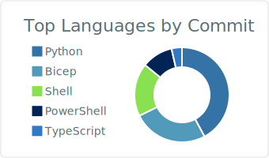
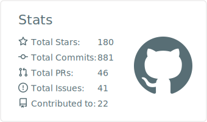

### Hi there, I'm Matt Hansen 

---

You'll find here my public and forked repositories. Feel free to contact me if you have any suggestions or questions.

---

🧰 Toolbox
<!--Toolbox icons -->

---

  
  

---

<picture>
  <source media="(prefers-color-scheme: dark)" srcset="https://raw.githubusercontent.com/matthansen0/matthansen0/output/github-contribution-grid-snake.svg" />
  <source media="(prefers-color-scheme: light)" srcset="https://raw.githubusercontent.com/matthansen0/matthansen0/output/github-contribution-grid-snake.svg" />
  
</picture>

---

Chat with me on LinkedIn

	
	
	

